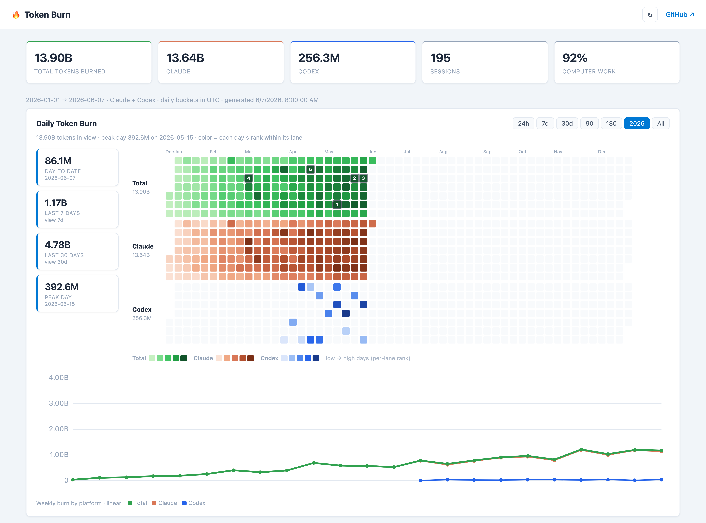
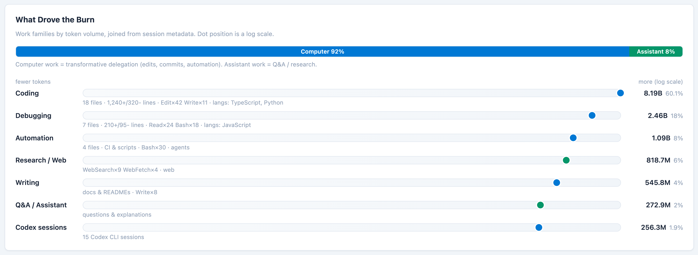
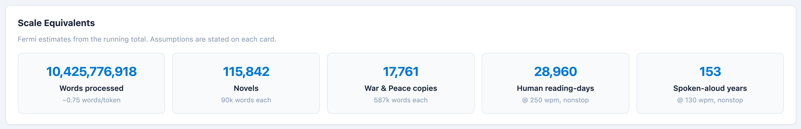

# 🔥 Token Burn

A local, **zero-dependency** dashboard for your **Claude Code** and **Codex** token usage. It reads the session logs those tools already write to your home folder and turns them into GitHub-style heatmaps, per-platform lanes, trend lines, and a breakdown of *what kind of work* drove your usage.

Everything runs on your machine. **No data leaves your computer**, there are no API keys, and there are no npm dependencies.



> Inspired by Nate B. Jones' "Token Burn Dashboard" idea — the notion that token usage only means something when it's tied to the work you delegated.

## What it shows

- **Daily Token Burn** — per-platform calendar heatmaps (Total / Claude / Codex), colored by each day's *rank within its lane* so the full spectrum is always used. Full-year view, range presets (24h → all), top-5 day badges, and a hover card per day.
- **Rolling stats** — day-to-date, last 7 / 30 days, peak day.
- **What drove the burn** — your sessions classified into work families (coding, debugging, automation, research, …) with a computer-work vs assistant-work split.
- **Weekly trend** — a linear line chart of weekly burn per platform.
- **Scale equivalents** — Fermi estimates (words, novels, reading-days…) from your running total.
- **Insights** — if you've run Claude Code's `/insights`, four cards grade whether the burn was *worth it*: session **outcomes & helpfulness**, **how you work** (tokens by session style), a **recent-sessions** feed (outcome + cost per session), and a **friction log** of where things took extra iterations. Joined to tokens by session id; hidden if you have no `/insights` data.





## Requirements

- **Node.js ≥ 18** (no other dependencies)
- **Claude Code** installed and used (it writes session logs to `~/.claude/projects`). Optional: **Codex CLI** (`~/.codex/sessions`).

## Quick start

```bash
git clone https://github.com/BadassHomesteader/dashboard-token-burn.git
cd dashboard-token-burn
node server.js
# → open http://localhost:4321
```

That's it. The page reads your local data live; click **↻** to refresh after more usage. Use `PORT=8080 node server.js` for a different port.

## How it works

```
server.js            zero-dep Node HTTP server: serves public/ + GET /api/token-burn
lib/
  claude.js          parses ~/.claude/projects/**/*.jsonl  (per-message token usage)
  codex.js           parses ~/.codex/sessions/**/rollout-*.jsonl  (token_count events)
  classify.js        reads ~/.claude/usage-data/session-meta/*.json → work families
  aggregate.js       composes daily/weekly/drivers/fermi/estimate into one payload
  cache.js           5-minute in-memory cache (so it doesn't re-parse on every load)
public/
  index.html         the dashboard (self-contained CSS)
  token-burn.js      the renderer (vanilla JS, no chart libraries)
scripts/
  generate-snapshot.js   writes public/data/token-burn.json for static hosting
```

### Data sources

| Source | Path | What's read |
|---|---|---|
| Claude Code | `~/.claude/projects/**/*.jsonl` | per-message `usage` (input/output/cache) + model + timestamp |
| Claude work meta | `~/.claude/usage-data/session-meta/*.json` | tools, languages, git activity → work-family labels |
| Claude `/insights` | `~/.claude/usage-data/facets/*.json` | per-session outcome, helpfulness, session type, friction → the Insights cards (run `/insights` to populate) |
| Codex CLI | `~/.codex/sessions/**/rollout-*.jsonl` | `token_count` events (input/output/cached/reasoning) |

ChatGPT is **not** included — there's no local usage log to read (it would require a manual data export).

### Notes & caveats

- **The "What Drove the Burn" section needs** `~/.claude/usage-data/session-meta/` (written by Claude Code's usage/reporting feature). If you don't have it, that one section is empty — the heatmaps, totals, trends, and Fermi cards all still work from the transcripts.
- **Claude Code prunes old logs** after `cleanupPeriodDays` (default 30). To keep more history, set a larger value in `~/.claude/settings.json` (e.g. `"cleanupPeriodDays": 365`).
- **Gap estimation:** if there's a large (≥14-day) hole in your local logs, the heatmap fills it with an *interpolated estimate* (clearly labeled, excluded from headline totals). Continuous data → no estimate.
- **History recovery (optional):** drop a `data/claude-history.json` of `{ daily: [{date, claude, messages}] }` to prepend older history you've archived.
- Daily buckets use your **system-local timezone** so "today" matches your calendar day. Override with `TOKEN_BURN_TZ` (e.g. `TOKEN_BURN_TZ=America/New_York node server.js`). The recovered-history fallback stays date-only.

## Static hosting (optional)

To host it read-only (GitHub Pages, Netlify, etc.) where there's no server to read your files:

```bash
npm run snapshot   # writes public/data/token-burn.json from your local data
```

The frontend automatically falls back to that snapshot when `/api/token-burn` isn't reachable. Re-run to refresh.

## Privacy

The server only ever reads the listed files and serves them to `localhost`. Your prompts and code are **not** read — only token counts, timestamps, models, and aggregate session metadata (tool counts, languages, git activity). The generated snapshot contains no prompt text.

## Want an AI agent to build you a custom version?

See [`PROMPT.md`](PROMPT.md) — a complete build spec you can hand to Claude Code (or any coding agent) to generate your own dashboard tailored to your stack.

## License

MIT
